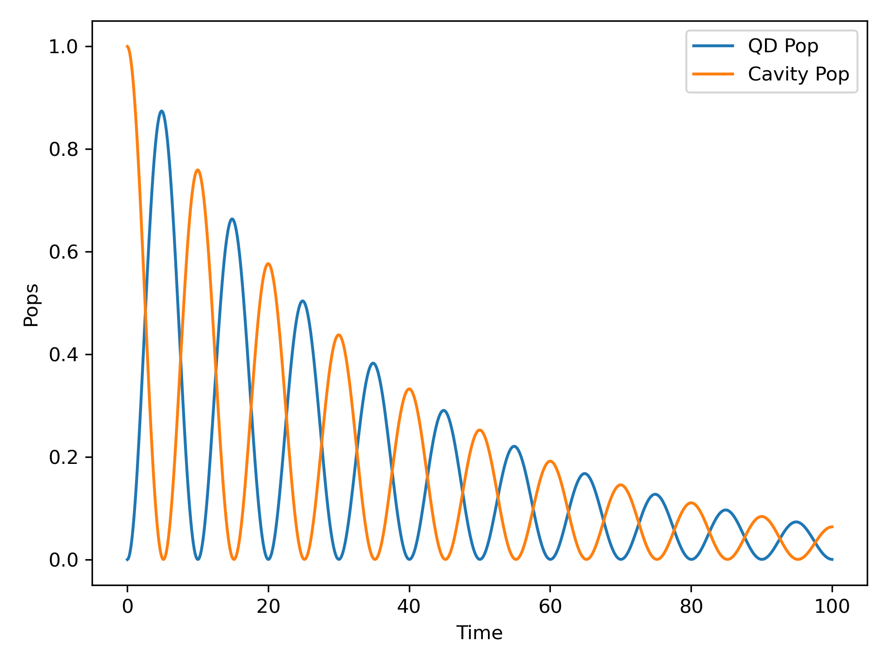

# QuaC

QuaC (Quantum in C) is a parallel time dependent open quantum systems solver, written by Matthew Otten (mjotten@wisc.edu). QuaC utilizes PETSc (www.mcs.anl.gov/petsc) for parallelization and linear algebra and features are still regularly being added.

QuaC strives to make the process of translating the physics equations into parallel code as simple as possible. QuaC supports both features for both general open quantum systems (such as Jaynes-Cummings models or simulations of physical systems such as neutral atoms, nitrogen vacancies, spin-boson models, etc) as well as specific quantum information features for qubits, such as gates and circuits. 

## A Tutorial

### Building

Before building QuaC, you'll need [PETSc](http://www.mcs.anl.gov/petsc) and [SLEPc](http://slepc.upv.es/) configured to use complex scalar types (note that real scalar types are the default) and, if you plan to run exceptionally large systems, you will want to use 64 bit integers. Once those packages are installed, and the environmental variables `PETSC_ARCH`, `PETSC_DIR`, and `SLEPC_DIR` are set (`PETSC_ARCH` should be set to something like linux-gnu-c-complex-int64-sprng), you'll be able to build QuaC using make.

For example, to install on a standard Linux system, something along these lines should work:

```
git clone https://gitlab.com/petsc/petsc.git petsc
cd petsc
git checkout main

export PETSC_DIR=${PWD}
export PETSC_ARCH=linux-gnu-c-complex-int64-sprng

./configure --with-scalar-type=complex --download-mpich --download-fblaslapack=1 \
  --with-debugging=no COPTFLAGS=-O3 CXXOPTFLAGS=-O3 FOPTFLAGS=-O3 --with-64-bit-indices --download-sprng
make PETSC_DIR=${PETSC_DIR} PETSC_ARCH=${PETSC_ARCH} all

cd ..
git clone https://gitlab.com/slepc/slepc
cd slepc
git checkout main

export SLEPC_DIR=${PWD}
./configure
make SLEPC_DIR=${SLEPC_DIR}

cd ..
git clone -b main https://github.com/0tt3r/QuaC
cd QuaC
make simple_jc_test
./simple_jc_test > out
```
The output of `./simple_jc_test` should be a bunch of numbers, showing the populations oscillating between the QD and the oscillator. This can be plotted in python via
```python
import matplotlib.pyplot as plt
import numpy as np
data = np.loadtxt("out",skiprows=2)
plt.plot(data[:,1],data[:,2],label="QD Pop")
plt.plot(data[:,1],data[:,3],label="Cavity Pop")
plt.xlabel("Time")
plt.ylabel("Pops")
plt.legend()
plt.tight_layout()
plt.show()
```
This should look like the figure below


The environmental variables ```PETSC_DIR```, ```PETSC_ARCH```, and ```SLEPC_DIR``` will need to be added to your profile (such as ~/.bashrc file) so that they are automatically loaded whenever you start a new terminal.
